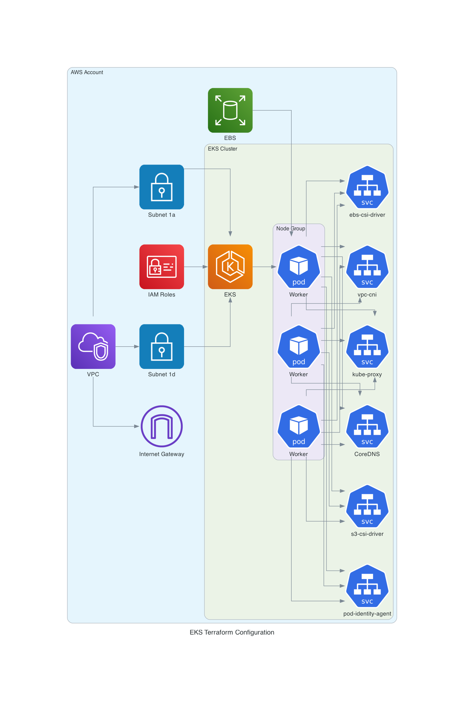

# YAML to Diagrams Converter

This Python library converts YAML descriptions into network diagrams using the `diagrams` library. It allows you to easily create complex network diagrams from simple YAML configurations.

## Features

- Convert YAML descriptions to network diagrams
- Support for multiple node types from the `diagrams` library
- Ability to create clusters and nested structures
- Flexible connection definitions
- Custom output naming

## Installation

1. Clone this repository:

   ```
   git clone https://github.com/robertkozak/yaml-to-diagrams.git
   cd yaml-to-diagrams
   ```

2. Install the required dependencies:
   ```
   pip install -r requirements.txt
   ```

## Usage

1. Create a YAML file describing your network diagram. For example, `network.yaml`:

   ```yaml
   diagram:
     name: EKS Terraform Configuration
     direction: TB

   clusters:
     - name: VPC (emburse-sandbox)
       nodes:
         - name: VPC
           type: network.VPC
         - name: Private Subnets
           type: network.PrivateSubnet
         - name: Linux Security Group
           type: network.ApplicationSecurityGroups
       clusters:
         - name: EKS Cluster
           nodes:
             - name: EKS Control Plane
               type: compute.EKS
           clusters:
             - name: Node Groups
               nodes:
                 - name: eks-nodes
                   type: compute.EC2
                 - name: app-nodes
                   type: compute.EC2

   nodes:
     - name: EKS Cluster Auth
       type: security.IAM
     - name: Terraform Module
       type: generic.Compute

   connections:
     - from: VPC
       to: Private Subnets
     - from: VPC
       to: Linux Security Group
     - from: Private Subnets
       to: EKS Control Plane
     - from: Linux Security Group
       to: [eks-nodes, app-nodes]
     - from: EKS Control Plane
       to: [eks-nodes, app-nodes]
     - from: EKS Cluster Auth
       to: EKS Control Plane
     - from: Terraform Module
       to: EKS Control Plane

   outputs:
     - name: EKS Endpoint
       from: EKS Control Plane
     - name: Cluster Certificate Authority Data
       from: EKS Control Plane
     - name: Node Groups Info
       from: [eks-nodes, app-nodes]
     - name: Worker Security Group
       from: Linux Security Group
   ```

2. Run the script with your YAML file:

   ```
   python yaml_to_diagrams.py network.yaml
   ```

3. The script will generate a diagram based on your YAML description and save it as `simple_network.png` (or whatever name you specified in the `output_file` field).



## YAML Structure

- `diagram`: Contains general diagram settings

  - `name`: The title of your diagram
  - `direction`: The flow direction of the diagram (TB, BT, LR, or RL)
  - `output_file`: The name of the output file (without extension)

- `nodes`: List of nodes in your diagram

  - `name`: The name of the node
  - `type`: The type of the node (must be a valid node type from the `diagrams` library)
  - `count` (optional): Number of instances of this node

- `clusters`: List of clusters in your diagram (can be nested)

  - `name`: The name of the cluster
  - `nodes`: List of nodes in this cluster (same structure as top-level nodes)
  - `clusters`: List of sub-clusters (can be nested further)

- `connections`: List of connections between nodes

  - `from`: The source node
  - `to`: The destination node(s) (can be a single node or a list)

- `outputs`: List of outputs from nodes
  - `from`: The source node
  - `name`: The name of the output

## Contributing

Contributions are welcome! Please feel free to submit a Pull Request.

## License

This project is licensed under the MIT License - see the [LICENSE](LICENSE) file for details.

## Acknowledgments

- This project uses the [diagrams](https://github.com/mingrammer/diagrams) library by mingrammer.
- Inspired by the need for easy, programmable network diagrams.
